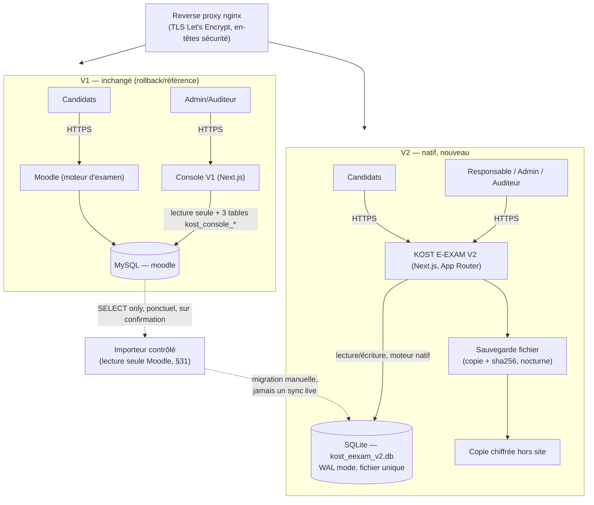
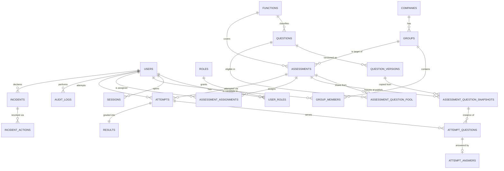

# KOST E-EXAM V2 — Architecture native (sans Moodle)

**Statut :** premier livrable, avant implémentation majeure (règle §35 de la mission).
**Branche :** `feature/kost-eexam-v2-native`
**Date :** 2026-08-26
**Contexte déclencheur :** audit ANAC du 26/08/2026 — 13 écarts relevés, Moodle jugé trop complexe pour l'usage opérationnel et pour une démonstration claire.

---

## 1. Constats sur le système actuel

Inspection de `platform-ops/kost-eexam-console-src/` (la vraie console, Next.js 16 / React 19 / Tailwind v4, `iron-session`, `mysql2`) et de sa documentation d'audit (`AUDIT_ANAC_2026-08-26/`, `docs/DGR_MOODLE_BANK_INTEGRATION_PLAN.md`).

### 1.1 Deux applications, une base

- **Espace candidat = Moodle** (moteur d'examen : chronomètre, questions, soumission, notation) — Moodle 5.0.1, conteneur Docker `moodle-stack_moodle_1`.
- **Console KOST E-EXAM** = appli Next.js dédiée pour Administrateur/Auditeur (suivi, rapports, conformité) — conteneur `kost-console-stack_console_1`.
- Les deux tournent sur **le même serveur dédié en Algérie**, connectées à la **même base MySQL** (`moodle-stack_db_1`).
- Identité unique : aucun compte console séparé — un compte est géré une seule fois, **dans Moodle** (`lib/auth-roles.ts` résout le rôle console depuis `mdl_role_assignments`).

### 1.2 Couplage Moodle — précis, fichier par fichier

| Domaine | Fichier | Couplage |
|---|---|---|
| Questions | `lib/question-bank-data.ts` | lit `mdl_question`, `mdl_question_versions`, `mdl_question_bank_entries`, `mdl_question_categories`, `mdl_tag*` |
| Examens | `lib/exams-data.ts` | lit `mdl_quiz`, `mdl_course`, `mdl_quiz_slots`, `mdl_grade_items`, tags `function-*` |
| Résultats | `lib/results-data.ts` | lit `mdl_quiz_attempts`, `mdl_grade_grades` |
| Sessions/candidats | `lib/sessions-data.ts`, `lib/candidates-data.ts` | dérivées des fenêtres `timeopen/timeclose` du quiz Moodle — « Moodle n'a pas d'entité "session" distincte » (commentaire du code) |
| Rôles | `lib/auth-roles.ts` | mapping `mdl_role_assignments` → 4 rôles console (`kost_console_admin_role`, etc.) |
| Accès DB | `lib/db-readonly.ts` | pool MySQL **SELECT only**, compte `kost_console_ro` |
| Écriture | `lib/db-readwrite.ts` | compte `kost_console_rw`, **restreint par GRANT MySQL** à 3 tables `kost_console_*` (incidents, incident_events, feedback) — zéro accès `mdl_*`, vérifié via `SHOW GRANTS`, pas seulement par convention de code |
| Création d'examen | `moodle-scripts/assessment-workflow/create_assessment.php` | script PHP CLI, tourne côté Moodle (tirage aléatoire via `mod_quiz\structure::add_random_questions()`, seuil via l'API `grade_item` de Moodle) — **exécuté manuellement en SSH**, pas d'API/UI console (§-1bis du plan documente le spec, « ready to build, not yet built ») |
| Contenu réglementaire | 97 questions FROZEN importées dans Moodle (Fonctions 7.1–7.10), `idnumber` = ID KOST (`Q-7.X-0NN`), traçabilité dans `docs/DGR_MOODLE_IMPORT_TRACEABILITY_7.X.csv` | le contenu source complet (453 items, statuts FROZEN/DRAFT/GAP/STALE) vit sur une branche séparée non fusionnée (`ai/dgr-stage2b-handoff`), hors du périmètre de cette mission (§32) |

**Conclusion :** le couplage Moodle est total pour tout ce qui touche candidats/questions/examens/tentatives/notation/résultats. C'est exactement le périmètre que V2 doit rendre natif.

### 1.3 Ce qui existe déjà et fonctionne bien (à ne pas jeter)

- **Auth** : `iron-session`, cookie chiffré `kost_eexam_session`, `httpOnly`, `secure` en prod, `sameSite: strict`, expiration 8h (`lib/session.ts`).
- **RBAC** : 4 rôles déjà nommés et enforcés en middleware (`administrator`, `exam_manager`, `instructor`, `auditor`) — proche du modèle demandé (Admin/Responsable pédagogique/Candidat/Auditeur), il manque le rôle Candidat.
- **Séparation lecture/écriture au niveau DB**, pas seulement applicatif — bon réflexe de sécurité à reproduire.
- **Scope Production/Démo/Entraînement** (`lib/data-scope.ts`) — classification explicite, jamais une donnée réelle n'est masquée par erreur ; répond déjà à l'esprit du §30 de la mission (même si aujourd'hui dérivée par regex sur le nom, pas par colonne explicite).
- **UI shell complet** : `components/layout/{ConsoleShell,Sidebar,Topbar}.tsx`, `lib/nav-config.ts` (source unique de navigation), `components/ui/{Badge,Card,EmptyState}.tsx`, `components/dashboard/KpiCard.tsx` — cohérent, français, déjà pensé pour un usage d'audit.
- **Incidents** : `app/(console)/incidents/` + `lib/incidents-data.ts` + `lib/incident-constants.ts` — modèle de données et UI de déclaration/changement de statut déjà là, mais **actions administrateur réelles** (suspendre compte, forcer déconnexion, révoquer sessions) pas encore construites — c'est du texte, pas des boutons qui agissent.
- **Système de santé/sauvegarde** : `lib/system-health.ts` lit un journal `backup-log.jsonl` (format déjà pensé pour distinguer Local/Off-site/Restore Test, avec `not_available` explicite si rien n'existe — jamais de donnée inventée). Un vrai test de restauration a été exécuté et documenté (`AUDIT_ANAC_2026-08-26/_source/04_rapport_restauration.md`, 491/491 tables restaurées, environnement isolé jetable, succès).
- **Sécurité réseau/TLS** : en-têtes de sécurité et TLS gérés au niveau **nginx** (`moodle-scripts/nginx-moodle-vhost.conf`), pas dans `next.config.ts` (qui est vide) — DB jamais exposée à internet, seul le flux HTTPS public l'est.
- **Workflow Exercice/Test/Examen** : conçu et **prouvé en conditions réelles côté Moodle** le 25-26/08 (`create_assessment.php`, isolation catégorie+tag vérifiée, seuil via l'API grade native, tentative candidat réelle 100/100). La logique métier (presets, tirage filtré, seuil configurable) est donc déjà validée fonctionnellement — c'est son **infrastructure** (Moodle) qu'il faut remplacer, pas sa conception.

### 1.4 Vérité additionnelle relevée pendant l'inspection

Le dernier commit de la branche (`0e404f9`) porte précisément sur ce workflow Exercice/Test/Examen — mais **côté Moodle** (script PHP), avec l'UI console explicitement notée « pas construite ce soir-là ». La mission actuelle ne prolonge donc pas ce script Moodle : elle construit l'équivalent natif, avec sa propre source de vérité.

### 1.5 Compléments issus d'une seconde passe d'inspection (agent dédié)

- **La connexion V1 n'est pas qu'une lecture de rôle en base** : c'est un relais d'identifiants **en direct** vers `POST {MOODLE_INTERNAL_URL}/login/token.php` (Web Service Moodle), puis `core_webservice_get_site_info`, puis résolution du rôle console via `mdl_role_assignments`. **Deux portes indépendantes côté Moodle** doivent être vraies : rôle console reconnu **et** compte explicitement whitelisté dans `mdl_external_services_users` pour le service `kost_eexam_console` — une config Moodle invisible dans le code Next.js. Ce couplage disparaît entièrement en V2 (identité native, aucun relais).
- **Constat produit important** : sur les 4 rôles console annoncés (`administrator`, `exam_manager`, `instructor`, `auditor`), **seuls `administrator` et `auditor` sont prouvés fonctionnels en production** — `exam_manager`/`instructor` (les plus proches du futur « Responsable pédagogique ») ne donnent pas accès à la console même whitelistés, gap documenté explicitement dans la suite Playwright (`rbac.spec.mjs`, tests « GAP FINDING ») et le README. Ce n'est pas un bug de sécurité, mais ça confirme qu'il n'existe **aucun code V1 réellement éprouvé** à porter pour le rôle Responsable pédagogique ni pour un futur rôle Candidat (qui n'a jamais existé côté console) — V2 les construit entièrement neufs, ce qui est cohérent avec le modèle `users`/`roles` natif retenu au §5/§6 (élimine cette classe de bug : plus de mapping fragile vers une table de rôles externe).
- **En-têtes de sécurité HTTP** : ils sont bien vérifiés **live** par `security-headers.spec.mjs` (HSTS, `X-Content-Type-Options`, `Referrer-Policy`, CSP), mais **aucun fichier commité** (ni le vhost nginx Moodle versionné, ni `next.config.ts` qui est vide, ni `middleware.ts`) ne les définit — ils proviennent d'une config serveur non versionnée. C'est un vrai écart de V1, pas seulement un choix d'architecture différent. **V2 corrige cet écart** en définissant les en-têtes dans le code (`next.config.ts` `headers()`), en plus du nginx du nouveau vhost — traçable en Git, pas seulement sur le serveur.
- **Export CSV : n'existe nulle part dans V1**, ni en dépendance ni en code — 100 % nouveau en V2 (confirmé, pas seulement probable). Le PDF existant est du `window.print()` côté navigateur (`PrintButton.tsx`/`ReportPrintHeader.tsx`) — pattern réutilisable pour les rapports PDF P2, mais pas un générateur serveur.
- **Aucun composant modal/dialogue n'existe dans V1** (tous les formulaires sont en page, jamais en superposition) — le détail de tentative candidat (§13 de la mission, drill-down question par question) nécessite un composant neuf en V2, pas un portage.
- **Aucun framework de tests unitaires** (pas de Jest/Vitest) côté V1 ; la seule suite Playwright cible directement `console.kostacademy.com` **en production**, sans serveur de dev local. V2 a donc besoin d'une suite entièrement neuve avec un `webServer` Playwright local (voir §16) — cohérent avec la décision déjà prise dans ce document.

---

## 2. Ce qui est réutilisé dans V2

| Élément | Réutilisation |
|---|---|
| Stack | Next.js (App Router) + TypeScript + Tailwind v4 + `iron-session` — même stack, mêmes réflexes d'équipe |
| Cookie de session | Même configuration (`httpOnly`, `secure`, `sameSite: strict`, expiration courte) — portée telle quelle dans `lib/session.ts` de V2 |
| UI shell | `ConsoleShell` / `Sidebar` / `Topbar` / `nav-config.ts` / `components/ui/*` — portés et adaptés (4 rôles au lieu de 4 rôles staff-only, ajout du rôle Candidat avec un shell différent) |
| Scope explicite | Le concept Production/Démo/Test de `data-scope.ts` — repris mais **en colonne explicite** en base (§30 l'exige : « chaque objet démo doit porter un scope explicite »), pas en regex sur un nom |
| Séparation lecture/écriture | Reproduite : un rôle applicatif limité en écriture aux tables V2 (n'a jamais existé de dépendance Moodle à limiter ici, mais le réflexe — séparer les permissions au niveau moteur de données, pas seulement au niveau code — est repris) |
| Format des journaux santé/sauvegarde | `backup-log.jsonl` (mêmes champs : `type`, `status`, `sha256`, `duration_seconds`, `restored_table_count`...) — réutilisé tel quel pour que `/system` affiche une continuité, jamais de `not_available` maquillé |
| En-têtes de sécurité | Pattern nginx repris pour le déploiement V2 (nouveau vhost) + ajout défensif dans `next.config.ts` (rien ne l'empêche, double couche) |
| Docker | `Dockerfile` multi-stage (`deps` → `builder` → `runner`, utilisateur non-root `nextjs`) repris quasi à l'identique |
| Conception métier Exercice/Test/Examen | Les presets (tentatives, feedback, mélange, seuil configurable — jamais présenté comme universel IATA) validés côté Moodle le 25-26/08 sont repris **tels quels** comme spécification produit, réimplémentés nativement |
| Modèle Incidents | Les catégories/priorités/statuts (`lib/incident-constants.ts`) et le flux de `IncidentsTable`/`IncidentForm` — repris et complétés avec de vraies actions serveur |

## 3. Ce qui est retiré de la dépendance runtime

Tout ce qui, aujourd'hui, nécessite une requête `mdl_*` en temps réel :

- Authentification/rôle candidat et staff → nouvelle table `users` + `roles`, plus aucune lecture de `mdl_role_assignments`.
- Questions/banque → nouvelles tables `questions` / `question_versions`, plus aucune lecture de `mdl_question*`.
- Examens/tentatives/notation/résultats → nouvelles tables `assessments` / `attempts` / `results`, plus aucune lecture de `mdl_quiz*` / `mdl_grade_*`.
- Le tirage aléatoire, le seuil de réussite, le timer, l'auto-soumission → réimplémentés en TypeScript, aucun appel à l'API Moodle (`add_random_questions()`, `grade_item`, etc.).

**Moodle reste intact, non modifié, non supprimé** — V2 ne lui adresse plus aucune requête au runtime. La console V1 continue de fonctionner exactement comme aujourd'hui (rollback/référence), sur son conteneur actuel, inchangée.

---

## 4. Architecture cible



- **Nouvelle application** : `platform-ops/kost-eexam-v2/` — répertoire frère de `kost-eexam-console-src/`, **aucun import croisé au runtime** entre les deux apps (isolation complète, un déploiement de V2 ne peut jamais casser V1).
- **Base de données** : SQLite fichier unique (`better-sqlite3`, mode WAL), pas MySQL/Postgres. Justification (décision documentée, pas silencieuse) :
  - Le volume réel (dizaines de groupes, quelques centaines de candidats, un seul processus Node écrivain sur un VPS dédié) ne justifie pas un serveur DB séparé.
  - **Sauvegarde/restauration triviale et réellement testable tout de suite** (copie de fichier + checksum) — répond directement à l'exigence §21 (« TESTER une restauration isolée, une documentation seule ne suffit pas »), sans dépendre d'infrastructure externe.
  - Conserve la **résidence des données en Algérie**, sur le même serveur dédié déjà utilisé — pas de nouveau fournisseur cloud, pas de question de souveraineté des données candidats à trancher pour un audit ANAC.
  - Transactions ACID réelles → utilisées explicitement pour garantir « une seule tentative » sous concurrence (§9) via contrainte + transaction, pas une astuce applicative fragile.
  - Réévaluable plus tard vers Postgres si le volume l'exige un jour — le schéma est écrit en SQL portable, sans fonctionnalité propriétaire SQLite exotique.
- **Déploiement** : même serveur dédié, nouveau conteneur Docker `kost-eexam-v2` (Dockerfile quasi identique à V1), nouveau vhost nginx (sous-domaine à confirmer, ex. `v2.kostacademy.com` en staging). **Aucune action de déploiement production n'est exécutée sans confirmation explicite** — c'est une action difficile à annuler sur un serveur en production, hors du périmètre que cette mission autorise à faire seul (règle §34 : interrompre pour « action de production irréversible sans rollback »). Le Dockerfile/compose/vhost sont préparés et documentés ; le `go` de mise en ligne reste à donner.

---

## 5. Modèle de données — ERD



### Tables (normalisées, noms indicatifs — voir §27 de la mission pour la liste demandée, adaptée ici)

- **users** `(id, email, username, password_hash, full_name, phone, status[active|suspended], mfa_enabled, created_at, last_login_at)`
- **roles** `(id, code, label)` — 4 lignes fixes : `candidate`, `pedagogical_manager`, `administrator`, `auditor`
- **user_roles** `(user_id, role_id)`
- **sessions** — registre serveur des sessions actives, **distinct** du cookie `iron-session` (voir §12 — nécessaire pour une révocation server-side réelle) : `(id, user_id, session_token_hash, created_at, last_seen_at, expires_at, revoked_at, revoked_by, ip_address, user_agent)`
- **companies** `(id, name, scope[production|demo|test], created_at, created_by)`
- **groups** `(id, company_id, name, session_label, date_start, date_end, pedagogical_manager_id, status, scope, created_at, created_by)`
- **group_members** `(group_id, candidate_user_id, added_at, added_by)`
- **functions** `(code PK '7.1'…'7.10', label)`
- **questions** `(id, kost_question_id UNIQUE, function_code, subtask, qtype, language, source_status[FROZEN_SOURCE_VERIFIED|DRAFT|PARTIAL|STALE|SOURCE_GAP|SOURCE_CONFLICT|NOT_ATTEMPTED], regulatory_reference, reviewer_status, review_date, verification_date, current_version_id, active, created_at, created_by, updated_at)`
- **question_versions** `(id, question_id, version_no, stem, choices_json, correct_answer, explanation, created_at, created_by)` — **append-only**, jamais d'`UPDATE` sur une version existante
- **question_tags** `(question_id, tag)`
- **assessments** `(id, type[exercice|test|examen], name, function_code, group_id, question_source[random|manual], question_count, duration_minutes, pass_threshold_pct, attempts_allowed, open_at, close_at, shuffle_questions, shuffle_answers, feedback_mode[immediate|deferred|none], show_result, show_correct_answers, status[draft|published|open|closed|suspended|archived], scope, created_by, created_at)` — `max_score` fixe à 100 (§10, jamais recalculé ailleurs)
- **assessment_question_pool** `(assessment_id, question_id)` — l'ensemble éligible (source du tirage ou de la sélection manuelle)
- **assessment_question_snapshots** `(id, assessment_id, position, question_id, version_id, stem_snapshot, choices_snapshot_json, correct_answer_snapshot, points)` — **copie figée exacte**, prise à la publication (§4 de la mission — critique pour l'audit)
- **assessment_assignments** `(assessment_id, candidate_user_id, assigned_at, assigned_by)`
- **attempts** `(id, assessment_id, candidate_user_id, attempt_number, status[in_progress|submitted|auto_submitted|abandoned], started_at, expires_at, submitted_at, ip_address, user_agent, created_at)` — `UNIQUE(assessment_id, candidate_user_id, attempt_number)` + index unique partiel garantissant **au plus une tentative non terminale** par couple (assessment, candidat)
- **attempt_questions** `(id, attempt_id, position, snapshot_id, marked_for_review)`
- **attempt_answers** `(id, attempt_id, attempt_question_id, answer_json, answered_at, is_correct, points_awarded)` — `is_correct`/`points_awarded` restent `NULL` jusqu'à la notation (jamais révélés côté client avant soumission)
- **results** `(id, attempt_id UNIQUE, raw_score, max_raw_score, score_100, percentage, pass_threshold_pct, passed, graded_at, locked)` — **source unique de vérité** (§10), écrite une seule fois par le moteur de notation
- **incidents** `(id, type, severity, occurred_at, description, system_concerned, people_concerned, responsible_user_id, status, created_by, created_at)`
- **incident_actions** `(id, incident_id, action_type[suspend_account|reactivate_account|force_logout|revoke_sessions|suspend_assessment|attach_evidence|note|corrective_measure|close], target_type, target_id, actor_user_id, detail, created_at)`
- **audit_logs** `(id, timestamp, actor_user_id, actor_role, action, target_type, target_id, result[success|failure], ip_address, session_id, metadata_json)` — **insert-only**, aucun chemin applicatif d'édition/suppression ; en production le rôle DB applicatif n'a pas de GRANT `UPDATE`/`DELETE` sur cette table (même réflexe que `kost_console_rw` limité par `SHOW GRANTS` en V1)
- **exports** `(id, type, requested_by, filters_json, row_count, created_at, file_checksum)`
- **imports** `(id, type, preview_json, status[preview|validated|committed|rejected], mapping_json, errors_json, source_import, imported_by, imported_at)`
- **backup_records** `(id, type[full_db|restore_test], status[success|failure], size_bytes, sha256, duration_seconds, detail, created_at)`

---

## 6. Matrice des rôles

| Capacité | Candidat | Responsable pédagogique | Administrateur | Auditeur |
|---|:---:|:---:|:---:|:---:|
| Se connecter, voir ses examens affectés, passer un examen | ✅ | – | – | – |
| Voir ses résultats (selon config) | ✅ | – | – | – |
| Créer client/groupe/candidats, affecter fonctions | – | ✅ | ✅ | 👁 lecture seule |
| Créer Exercice/Test/Examen, publier | – | ✅ | ✅ | 👁 |
| Suivre candidats, voir résultats, cliquer candidat, export CSV | – | ✅ | ✅ | 👁 |
| Gestion utilisateurs/rôles/permissions | – | – | ✅ | 👁 |
| Banque réglementaire (créer/modifier statut) | – | 👁 (consulter) | ✅ | 👁 |
| Sécurité, incidents, sessions, suspension, révocation | – | – | ✅ | 👁 + preuves |
| Sauvegardes/restauration | – | – | ✅ | 👁 preuve de test |
| Journal d'audit | – | – | 👁 (jamais modifiable par personne) | 👁 |

Un candidat ne voit jamais un autre candidat, une bonne réponse avant autorisation, ni ne modifie une note ou une question — appliqué **côté serveur** sur chaque route/action (jamais une vérification uniquement côté UI).

---

## 7. Cycle de vie d'une évaluation (Exercice/Test/Examen)

```
draft (formulaire en cours)
  → configured (type, fonction, nombre de questions ≤ disponibles, durée, seuil, tentatives, dates)
  → published  (SNAPSHOT pris ici : assessment_question_snapshots figé, immuable)
  → open       (fenêtre ouverture/fermeture active — candidats peuvent démarrer)
  → closed     (fenêtre fermée, ou clôture manuelle)
  → archived
        ↳ suspended (à tout moment, via Incident → « suspendre examen » — bloque tout nouveau démarrage/soumission)
```

Une fois `published`, modifier une `question_versions` source **n'affecte jamais** un `assessment_question_snapshots` déjà pris — c'est la garantie centrale du §4 de la mission (« voici exactement la question reçue par ce candidat, à cette date »).

## 8. Cycle de vie candidat (par tentative)

```
not_started → in_progress (started_at + expires_at posés en base, serveur)
   → submitted (action candidat)          ┐
   → auto_submitted (expires_at dépassé)  ┼→ graded (moteur de notation, synchrone) → visible (selon feedback_mode)
   → abandoned (fermeture sans soumission)┘
```

Le timer est **serveur** : `expires_at` est calculé et stocké à `started_at + duration_minutes` au démarrage. Chaque requête (page examen, sauvegarde de réponse) revérifie `now() >= expires_at` côté serveur et déclenche l'auto-soumission si dépassé — indépendant du navigateur (refresh, fermeture, perte réseau n'affectent jamais le temps réel restant, §8). Une tâche de balayage périodique (cron léger) auto-soumet aussi les tentatives dont personne n'a rouvert la page après expiration.

Unicité de tentative (§9) : contrainte DB (`UNIQUE` + index partiel sur tentative non terminale) + transaction `BEGIN IMMEDIATE` (SQLite) autour de « vérifier absence de tentative active → créer » — un double clic ou deux onglets ne peuvent pas créer deux lignes `in_progress` ; le deuxième appel échoue proprement et renvoie la tentative existante.

## 9. Cycle de vie du résultat

```
attempt.status ∈ {submitted, auto_submitted}
  → moteur de notation (fonction pure, un seul point d'entrée : gradeAttempt(attemptId))
  → results (1 ligne, locked=true pour un Examen dès l'écriture — jamais recalculé ailleurs)
  → visibilité candidat déterminée par assessment.feedback_mode / show_result / show_correct_answers
       A. note seule | B. note + bonnes/mauvaises | C. correction complète | D. différé jusqu'à fermeture
```

## 10. Cycle de vie d'un incident

```
déclaré (type, gravité, description, système/personnes concernées, responsable)
  → investigation (actions : suspendre compte, réactiver, forcer déconnexion, révoquer sessions,
                    suspendre examen, joindre preuve, ajouter mesure corrective — chacune tracée)
  → mesure(s) corrective(s) consignée(s)
  → résolu → clôturé
```

Chaque action génère **deux écritures dans la même transaction** : une ligne `incident_actions` et une ligne `audit_logs` — un seul point de code (`declareIncidentAction()`), jamais deux chemins divergents.

## 11. Cycle de vie de l'audit

Toute action mutante (connexion, création, modification, publication, tentative, export, incident, sauvegarde…) passe par un **unique helper serveur** `audit(actorId, action, target, result, metadata)`, appelé en fin de chaque server action / route API après (ou en cas d'échec de) l'opération métier — jamais construit ailleurs. La table est insert-only ; aucune UI d'édition n'existe, et le rôle DB applicatif de production n'a pas les droits d'`UPDATE`/`DELETE` dessus.

---

## 12. Modèle de sécurité

| Exigence (§19) | Mise en œuvre V2 |
|---|---|
| RBAC serveur | Middleware + vérification de rôle dans chaque server action/route (jamais une garde uniquement côté UI) |
| Ownership | Un candidat ne peut requêter que ses propres `attempts`/`results` (filtre `WHERE candidate_user_id = session.userId` systématique) |
| Cookies sécurisés | `iron-session`, `httpOnly`, `secure` (prod), `sameSite: strict`, expiration courte — repris de V1 |
| Révocation réelle | Table `sessions` server-side (voir §5) — un cookie valide dont la session est `revoked_at IS NOT NULL` est refusé au prochain hit, sans attendre l'expiration du cookie |
| CSRF | Server Actions Next.js (protection native par origine) + double-vérification sur les routes API sensibles |
| Rate limiting | Limiteur en mémoire/DB sur `/login` et sur la soumission de réponses (fenêtre glissante par IP+compte) |
| Mots de passe | `bcrypt` (coût 12), jamais en clair, jamais journalisé |
| MFA administrateur | Prévu (TOTP) si le temps du sprint P1 le permet — compatible avec l'architecture (colonne `mfa_enabled` + secret chiffré) |
| Secrets | `.env` hors Git (déjà dans `.gitignore` du dépôt), jamais committés |
| Headers sécurité | nginx (vhost dédié) + `next.config.ts` (double couche, défense en profondeur) |
| Logs d'audit | Voir §11 — insert-only |
| Sauvegardes/restauration | Voir §13 |

## 13. Sauvegarde / restauration

- **RPO cible** : 24h (sauvegarde nocturne automatique).
- **RTO cible** : < 30 min (copie de fichier unique, pas de reconstruction complexe).
- **Rétention** : 14 sauvegardes quotidiennes glissantes + 4 hebdomadaires (à confirmer avec KOST).
- **Mécanisme** : `VACUUM INTO` (SQLite) vers un fichier horodaté → `sha256sum` → copie chiffrée hors du serveur de production → entrée `backup_records` + ligne `backup-log.jsonl` (même format que V1, pour que `/system` reste cohérent entre les deux générations).
- **Test de restauration** : script qui restaure la dernière sauvegarde dans un répertoire **isolé et jetable**, ouvre le fichier avec `PRAGMA integrity_check`, compte les tables/lignes, compare au live, puis supprime la copie — jamais touché à la production. **Ce test sera exécuté réellement dans cette session** (pas seulement documenté) dès que des données de démo existent, pour prouver la chaîne avant de la déclarer faite (§21 : « une documentation seule ne suffit pas »).

## 14. Stratégie de migration

1. **Phase 0 (immédiate)** : V2 démarre avec sa propre base vide, zéro dépendance runtime à Moodle. V1/Moodle restent en service, inchangés, comme secours.
2. **Phase 1** : construire l'**importeur** (§31) — lit un export contrôlé (CSV, ou lecture SELECT-only ponctuelle de Moodle façon `db-readonly.ts`), preview + validation + mapping + confirmation avant tout commit, ne calcule ni n'invente aucun contenu réglementaire, préserve `kost_question_id` (= `idnumber` Moodle existant, `Q-7.X-0NN`), `function_code`, `subtask`, `source_status`, citation, version, métadonnées de review. Prouvé avec des données de démo d'abord.
3. **Phase 2 (nécessite confirmation explicite avant exécution)** : migration contrôlée des 97 questions FROZEN existantes depuis Moodle vers V2, en lecture seule côté Moodle (jamais d'écriture), avec journal d'import complet (`imports` table) — pas un synchronisation continue, une copie ponctuelle tracée.
4. **Bascule candidats réels** : seulement après démonstration complète de la chaîne du §37 (Definition of Done) et accord explicite — Moodle reste disponible en secours pendant une période de rétention à définir.

## 15. Phases d'implémentation (cette session)

Ordre P0 → P1 → P2 tel que défini au §36 de la mission, détaillé dans le todo-list de session. Voir `git log` sur `feature/kost-eexam-v2-native` pour l'avancement réel commit par commit — cette section n'est pas mise à jour rétroactivement pour ne pas prétendre un état non vérifié.

## 16. Plan de tests

- **Unitaires** : moteur de notation (`gradeAttempt`), calcul d'expiration du timer, garde d'unicité de tentative sous accès concurrent simulé.
- **Intégration** : chaque route/server action mutante testée avec les 4 rôles (accès autorisé/refusé), y compris l'auditeur (jamais d'écriture possible, même en forçant l'appel direct de l'action).
- **E2E (Playwright)** : scénarios A→J du §29 de la mission, un fichier de spec par scénario, exécutés contre une instance de dev locale (pas contre la production, à la différence de la suite V1 qui cible le site live — V2 aura son propre `webServer` Playwright local tant qu'aucun environnement de staging n'est déployé).

---

**Prochaine étape :** scaffolding de `platform-ops/kost-eexam-v2/`, schéma SQL, puis implémentation P0 dans l'ordre du todo-list de session.

---

## 17. État réel après implémentation P0 (mise à jour du 26/08/2026)

Section ajoutée après coup, en plus (pas à la place) du §15 — pour ne
jamais prétendre un état non vérifié, voici ce qui a été **réellement
construit et prouvé qui marche**, et les bugs réels trouvés en cours de
route (utile pour la suite du projet, pas seulement pour cette session).

### 17.1 Ce qui est construit et testé

- Schéma SQLite complet (`lib/schema.sql`), migration idempotente
  (`scripts/migrate.ts`).
- Auth/RBAC natifs (`lib/auth.ts`, `lib/rbac.ts`, `lib/sessions-registry.ts`)
  — 4 rôles, session native + registre serveur pour révocation réelle.
- Shell UI porté et adapté par rôle (candidat vs staff).
- Client → Groupe → Candidats (`lib/companies.ts`, `lib/groups.ts` + pages).
- Banque de questions avec statuts source et versions append-only
  (`lib/questions.ts`).
- Assistant de création d'évaluation (12 étapes, §5) + publication avec
  snapshot figé (`lib/assessments.ts`).
- Moteur candidat complet : démarrage protégé par contrainte DB unique,
  timer serveur, sauvegarde de réponse, marquage, soumission, auto-
  soumission (`lib/attempts.ts`, `ExamRunner.tsx`).
- Moteur de notation à source unique (`lib/grading.ts`).
- Résultats + drill-down question par question (`lib/results.ts` + pages).
- Export CSV résultats + réponses détaillées (routes API).
- Incidents avec actions réelles (suspendre/réactiver compte, révoquer
  sessions, suspendre/réouvrir examen) tracées en double (incident_actions
  + audit_logs).
- Sessions actives + révocation individuelle/globale.
- Journal d'audit insert-only.
- Sauvegarde + test de restauration isolé — **exécutés réellement** en
  session (`pnpm backup` puis `pnpm restore-test`, succès, intégrité
  vérifiée, tables comptées).
- Guides des 4 rôles.
- **6 tests unitaires** (`node --test`) : notation (2), garantie anti-
  double-tentative (2), application serveur du timer (2) — tous verts.
- **8 scénarios Playwright E2E** (sur build de production, DB de test
  dédiée, jetée à chaque run) : création+publication d'examen (B), parcours
  candidat complet avec rafraîchissement en cours de tentative (C), deux
  onglets → une seule tentative, vérifié en base (E), drill-down admin (F),
  export CSV (G), auditeur lecture seule — UI **et** refus serveur (H×2),
  incident → suspension → connexion bloquée → réactivation → connexion
  restaurée → trace d'audit (I) — tous verts.
- `pnpm build` propre (28 routes), `pnpm typecheck` propre.

### 17.2 Bugs réels trouvés et corrigés pendant la construction

Ces trois-là ne sont pas des détails cosmétiques — sans le premier, le
bouton « Commencer l'examen » ne fonctionnait tout simplement pas :

1. **`node:sqlite` renvoie des lignes à prototype nul**
   (`Object.create(null)`, vérifié directement), pas de vrais littéraux
   `{}`. Next.js refuse de sérialiser un objet à prototype nul à travers
   la frontière Server→Client (composants client, closures de Server
   Actions capturées pour la progressive enhancement) : *"Classes or null
   prototypes are not supported."* Corrigé une seule fois à la source
   (`lib/db.ts`, patch de `StatementSync.prototype.get/all`) plutôt que
   sur chaque site d'appel.
2. **Next.js 16 a renommé `middleware.ts` en `proxy.ts`** (même
   comportement, runtime Node.js par défaut) — `middleware.ts` est
   déprécié, pas supprimé, mais corrigé quand même (`proxy.ts`), après
   consultation de `node_modules/next/dist/docs/` comme demandé par
   `AGENTS.md` de ce projet.
3. **Les erreurs de rendu Server Component sont volontairement redactées
   en production** (sécurité React/Next — jamais de message/stack exposé
   au client) : un `throw new Error(...)` générique pour un refus de rôle
   au niveau PAGE n'affiche donc pas un message lisible en prod. Corrigé
   en distinguant deux cas d'usage : `requireRole()`/`requireWriteRole()`
   (throw — correct pour les Server Actions, dont les erreurs sont
   attrapées et renvoyées via `useActionState`) restent inchangées ;
   `guardPage()` (nouvelle fonction, `lib/rbac.ts`) fait un `redirect()`
   vers `/acces-refuse` pour les Server Components de page — toujours un
   refus serveur réel, exprimé via l'API que Next.js attend pour ce cas.

Deux ajustements d'infrastructure de test (sans impact production) :
`allowedDevOrigins` dans `next.config.ts` (Next 16 bloque par défaut les
assets de dev cross-origin entre `127.0.0.1` et `localhost`) et
`COOKIE_SECURE` (nouvelle variable d'environnement, `lib/session.ts`) pour
permettre de tester un build de production sur HTTP local sans désactiver
la protection `secure` en déploiement réel.

### 17.3 Ce qui reste (P1/P2, non fait cette session)

- MFA administrateur (prévu compatible, non implémenté).
- Import contrôlé CSV de résultats historiques (§16 de la mission).
- Rapports PDF (P2 — CSV livré, suffisant pour ne pas bloquer le MVP par
  instruction explicite du §15).
- Copie de sauvegarde chiffrée hors site (le mécanisme local + test de
  restauration sont prouvés ; la réplication hors site dépend du choix
  d'hébergement final, non tranché cette session).
- Déploiement réel sur le serveur dédié — `Dockerfile` et brouillons
  (`deploy/`) prêts, aucune action serveur exécutée (accès SSH sortant non
  exercé cette session, action de production nécessitant confirmation).
- Migration contrôlée des 97 questions FROZEN existantes depuis Moodle
  (§31/§14 de l'architecture — l'importeur reste à construire ; ne
  concerne pas le moteur lui-même, déjà fonctionnel avec un contenu de
  démonstration explicitement fictif).
